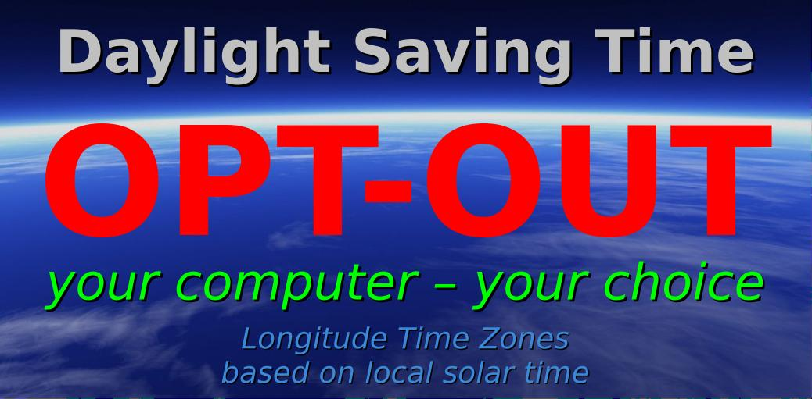

Longitude-based Time Zones
==========================

*Note Dec 1, 2025: the LongitudeTZ project is [overhauling the narrow overlay time zones](docs/2025-12-01-ltz-project-update.md) from 1-degree longitude (4 minutes clock time) to 3.75 degrees longitude (15 minutes clock time). There are no changes to the primary hour-wide time zones.*

See the project web site at [https://ikluft.github.io/LongitudeTZ/](https://ikluft.github.io/LongitudeTZ/)
 

## <a name="implementations">Implementations</a>

Solar TimeZone libraries implementations in different programming languages:

* [Perl](src/perl/) as _TimeZone::Solar_ module
  * 
  * available on MetaCPAN: https://metacpan.org/pod/TimeZone::Solar
  * adds solar timezones compatible with DateTime::TimeZone module
* [Python](src/python/) - as _timezone_solar_ package
  * 
  * available on PyPI: https://pypi.org/project/timezone_solar/
  * adds solar timezones compatible with datetime package
* [C++](src/cpp/) - as _libtzsolar_ package
* Rust - TODO
* others coming, code contributions will be considered

Each programming language implementation must follow the [LongitudeTZ Command Line Interface Specification](cli-spec.md) so that [generalized black box testing](test/) can be performed across all the implementations.

So far, black box tests have been written and run on the Perl, Python and C++ implementations.

