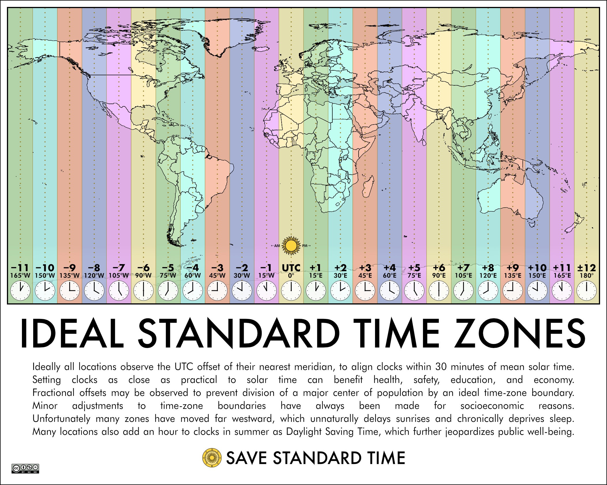
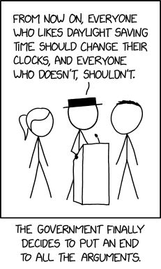

Longitude-based Time Zones
==========================
On this page:

* [Introduction](#introduction)
* [Implementations](#implementations)
* [The Solar Time Zones Definition](#the_solar_time_zones_definition)
* [Obsoleting Daylight Saving Time](#obsoleting_daylight_saving_time)
* [Web Resources](#web_resources)

## <a name="introduction">Introduction</a>

This project is intended to develop software and time zone data files so timekeeping devices can be set to natural longitude-based time zones for their locality. These are based on Standard Time for the longitude, without peculiarities set by local or national governments. These time zone files and the software to look up which one applies to the current location allow users' devices to automatically convert to or from conventional time zones used by government entities.

There are lots of reasons to do this...

People are tired of changing their clocks twice a year for daylight saving time. DST is an antiquated tradition which we now know doesn't do any good. ([see below](#web_resources)) There are many problems where DST has failed to deliver on its promises and/or is no longer useful the way it was originally intended.

* Standard time is based on setting the local clock at average solar noon, and so follows nature. Daylight saving time artificially offsets it an hour to favor late-day activities. But there is not actually more daylight - it stakes that hour from early-day activities.
* Daylight saving time does not actually save energy.
* Anyone can look up local sunrise and sunset times for planning events that actually need to be scheduled around daylight.
* Studies have established there are health and safety hazards from disrupting circadian rhythms (daily sleep cycles).

The real solution is to schedule activities around available sunlight at one's local latitude.

In places where regional government mandates use of Daylight Saving Time, the only way we'll have the choice to opt-out of DST is if there's an alternative standard allowing us to stay on Standard Time.

This project is intended to make such an alternative. The project is to make software libraries to set local solar/natural time zone based on longitude, and time zone files compatible with the *tz database* standard which allow any device or server to use them. The *tzfile* data files also allow systems to convert between traditional and longitude-based time zones automatically.

An example of the tzfile data for the proposed Longitude Time Zones is provided at [docs/longitude-timezones.tzfile](docs/longitude-timezones.tzfile) in this repository.

I'm running the idea up the flagpole. We'll see how many salutes it gets. Meanwhile this project is making software in various programming languages toward enabling the possibility.

National and regional governments continue to cling to daylight saving time partly because almost everyone else has such a standard. In this age where our computers and cell phones are integral to scheduling, we really only need a de-facto standard. _It is possible to just stop using DST_, and let our computers convert the times to and from others who continue to use DST. Fortunately, there are standards we can build upon.
* Lines of longitude are a well-established standard.
* Ships at sea use "nautical time" based on time zones 15 degrees of longitude wide.
* Time zones (without daylight saving offsets) are based on average solar noon at the Prime Meridian. Standard Time in each time zone lines up with average solar noon on the meridian at the center of each time zone, at 15-degree of longitude increments.

15 degrees of longitude appears more than once above. That isn't a coincidence. It's derived from 360 degrees of rotation in a day, divided by 24 hours in a day. The result is 15 degrees of longitude representing 1 hour in Earth's rotation. That makes each time zone one hour wide. So we'll use that too.

With those items as its basis, this project is to establish "Solar Time Zone" data for use with the Internet Assigned Numbers Authority's [TZ database](https://www.iana.org/time-zones), and eventually submit it for inclusion in the database and a paper with the definition, perhaps as an Internet RFC.

The project also makes and accepts contributions of code in various programming languages for anything necessary to implement this standard. That includes computing a Solar Time Zone from a latitude/longitude coordinates. Once part of the TZ Database, computers and phones which use it will be able to automatically convert times to and from the Solar Time Zones.

The project also makes another set of overlay time zones the width of 1 degree of longitude, which puts them in 4-minute intervals of time. These are a hyper-local niche for potential use by outdoor events. These may be used by those who would like to have the middle of the scheduling day coincide with local solar noon. 

## <a name="implementations">Implementations</a>

Solar TimeZone libraries implementations in different programming languages:

* [Perl](src/perl/) as _TimeZone::Solar_ module
  * 
  * available on MetaCPAN: https://metacpan.org/pod/TimeZone::Solar
* [Python](src/python/) - as _timezone_solar_ package
  * 
  * available on PyPI: https://pypi.org/project/timezone_solar/
* [C++](src/cpp/) - as _libtzsolar_ package
* Rust - TODO
* others coming, code contributions accepted

Each programming language implementation must follow the [LongitudeTZ Command Line Interface Specification](docs/cli-spec.md) so that [generalized black box testing](test/) can be performed across all the implementations.

## <a name="the_solar_time_zones_definition">The Solar Time Zones Definition</a>

Though not part of the LongitudeTZ project, this graphic by [Save Standard Time](https://savestandardtime.com/) exactly depicts the natural time zones this project also wants to implement.

The Solar time zones definition includes the following rules.

* There are 24 hour-based Solar Time Zones, named West12, West11, West10, West09 through East12. East00 is equivalent to UTC. West00 is an alias for East00.
  * Hour-based time zones are spaced in one-hour time increments, or 15 degrees of longitude.
  * Each hour-based time zone is centered on a meridian at a multiple of 15 degrees. In positive and negative integers, these are 0, 15, 30, 45, 60, 75, 90, 105, 120, 135, 150, 165 and 180.
  * Each hour-based time zone spans the area ±7.5 degrees of longitude either side of its meridian.
* There are 360 longitude-based Solar Time Zones, named Lon180W for 180 degrees West through Lon180E for 180 degrees East. Lon000E is equivalent to UTC. Lon000W is an alias for Lon000E.
  * Longitude-based time zones are spaced in 4-minute time increments, or 1 degree of longitude.
  * Each longitude-based time zone is centered on the meridian of an integer degree of longitude.
  * Each longitude-based time zone spans the area ±0.5 degrees of longitude either side of its meridian.
* In both hourly and longitude-based time zones, there is a limit to their usefulness at the poles. Beyond 80 degrees north or south, the definition uses UTC (East00 or Lon000E). This boundary is the only reason to include latitude in the computation of the time zone.
* When converting coordinates to a time zone, each time zone includes its boundary meridian at the lower end of its absolute value, which is in the direction toward 0 (UTC). The exception is at exactly ±180.0 degrees, which would be excluded from both sides by this rule. That case is arbitrarily set as +180 just to pick one.
* The category "Solar" is used for the longer names for these time zones. The names listed above are the short names. The full long name of each time zone is prefixed with "Solar/" such as "Solar/East00" or "Solar/Lon000E".

## <a name="obsoleting_daylight_saving_time">Obsoleting Daylight Saving Time</a>

The goal of this project is to aid existing and future efforts to end Daylight Saving Time with a feasible technical alternative. If it achieves that goal then it will continue to maintain the standard definition, reference libraries and data files for longitude-based time zones for cases where they are useful and desired.

[*XKCD comic #2846: "Daylight Saving Choice" 2023-10-28*](https://xkcd.com/2846/) (with attribution for Creative Commons CC-BY-NC-2.5 compliance)

## <a name="web_resources">Web Resources</a>

Nautical and longitude-based time:

* ["Nautical time"](https://en.wikipedia.org/wiki/Nautical_time), Wikipedia
* ["Military time zone"](https://en.wikipedia.org/wiki/Military_time_zone), Wikipedia

Related: time zone technical standards:

* [tzfile defining proposed Longitude Time Zones](docs/longitude-timezones.tzfile)
* ["tz database"](https://en.wikipedia.org/wiki/Tz_database), Wikipedia
* [Time Zone Database](https://www.iana.org/time-zones), Internet Assigned Numbers Authority (IANA)
* [RFC8536: The Time Zone Information Format (TZif)](https://www.rfc-editor.org/info/rfc8536), Internet Engineering Task Force (IETF)

Related: in favor of Standard Time:

* [Save Standard Time](https://savestandardtime.com/) - nonprofit organization promoting legislation for permanent standard time, opposing legislation for permanent daylight time
* [International Alliance for Natural Time](https://naturaltimealliance.org/en/) - group of organizations and projects promoting timekeeping based on natural solar time
* [Coalition for Permanent Standard Time](https://ditchdst.com/) - group of organizations opposed to the biannual clock change, advocating permanent standard time

Related: harmful effects of daylight saving time (DST):

* [Sleep experts call for end of seasonal time changes ahead of ‘springing forward’](https://aasm.org/sleep-experts-call-for-end-of-seasonal-time-changes-ahead-of-springing-forward/), American Academy of Sleep Medicine (AASM), 2024
* [Debunking myths about daylight saving time: ten things everyone should know about the benefits of permanent standard time](https://jcsm.aasm.org/doi/10.5664/jcsm.10666), Journal of Clinical Sleep Medicine, 2023
* [Daylight saving time is doing far more harm than good, according to sleep scientists](https://medicalxpress.com/news/2021-11-daylight-good-scientists.html) - Medical Xpress, 2022
* [Daylight Saving Time does not save energy](https://phys.org/news/2014-03-daylight-energy.html), Phys[.]Org, 2014
