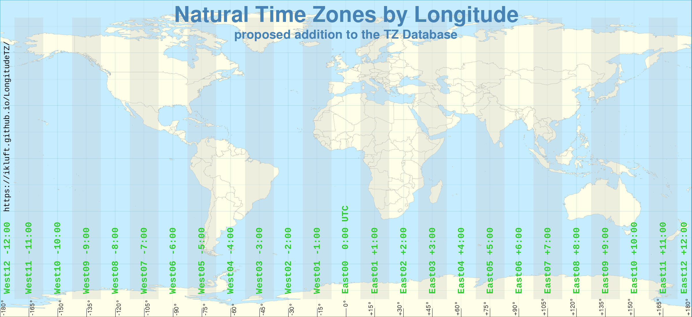

# LongitudeTZ library documentation

project documentation

* [Solar Time Zones Definition](solar_tz_definition.md)
* [LongitudeTZ Command-line Interface Specification](cli-spec.md)

## Longitude-based Time Zones
Many people are tired of changing their clocks twice a year for daylight time. DST is an antiquated tradition [which we now know doesn't do any good](https://www.webmd.com/sleep-disorders/news/20211105/harmful-effects-of-daylight-savings).

While there have been proposals for regional and national governments to repeal Daylight Saving Time, it hasn't made progress. One way to have the choice to opt-out of Daylight Saving Time is if there's an alternative standard allowing us to stay on Standard Time.

This is intended to make such an alternative. I'm running the idea up the flagpole. Meanwhile this project is making software in various programming languages toward enabling the possibility.

National and regional governments continue to cling to Daylight Saving Time mainly out of habit - this is how things have been done. In this age where our computers and cell phones are integral to scheduling, we really only need a de-facto standard. _It is possible to just stop using DST_, and let our computers convert the times to and from others who continue to use DST. Fortunately, there are standards we can build upon.

* Lines of longitude are a well-established standard.
* Ships at sea use "nautical time" based on time zones 15 degrees of longitude wide.
* Time zones (without daylight saving offsets) are based on average solar noon at the Prime Meridian. Standard Time in each time zone lines up with average solar noon on the meridian at the center of each time zone, at 15-degree of longitude increments.

15 degrees of longitude appears more than once above. That isn't a coincidence. It's derived from 360 degrees of rotation in a day, divided by 24 hours in a day. The result is 15 degrees of longitude representing 1 hour in Earth's rotation. That makes each time zone one hour wide. So we'll use that too.

With those items as its basis, this project is to establish "Solar Time Zone" data for use with the Internet Assigned Numbers Authority's [TZ database](https://www.iana.org/time-zones), and eventually submit it for inclusion in the database and a paper with the definition, perhaps as an Internet RFC.

The project also makes and accepts contributions of code in various programming languages for anything necessary to implement this standard. That includes computing a Solar Time Zone from a latitude/longitude coordinates. Once part of the TZ Database, computers and phones which use it will be able to automatically convert times to and from the Solar Time Zones.

The project also makes another set of overlay time zones the width of 1 degree of longitude, which puts them in 4-minute intervals of time. These are a hyper-local niche for anyone who prefers higher resolution such as for planning outdoor events around daylight. It may also be of interest to have smaller time increments in regions bisected by boundaries of hour-wide time zones. In general, the purpose is for more the middle of the scheduling day to coincide within a few minutes of local solar noon.

### The Solar Time Zones Definition

See the [Solar Time Zones Definition page](solar_tz_definition.md).
