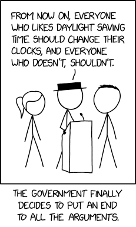
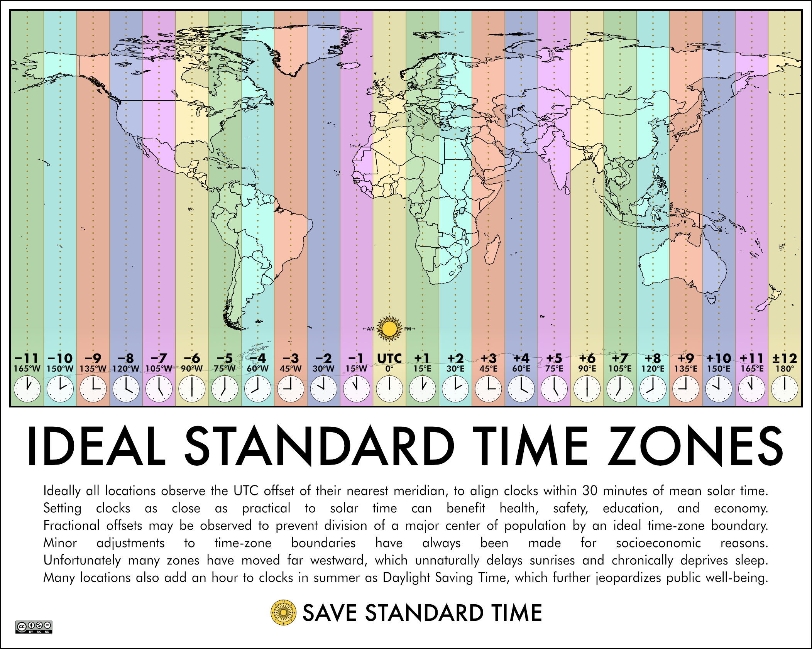

Natural Time Zones by Longitude
===============================

On this page:

* [Introduction](#introduction)
* [Creating an Alternative](#creating_an_alternative)
* [Obsoleting Daylight Saving Time](#obsoleting_daylight_saving_time)
* [Web Resources](#web_resources)

Project information:
* [Solar Time Zones Definition](solar_tz_definition.md)
* [Questions & Answers about Solar Time Zones](questions-answers.md)
* [LongitudeTZ Command-line Interface Specification](cli-spec.md)
* [GitHub repository](https://github.com/ikluft/LongitudeTZ)
 

## <a name="introduction">Introduction</a>

*Note Dec 1, 2025: the LongitudeTZ project is [overhauling the narrow overlay time zones](2025-12-01-ltz-project-update.md) from 1-degree longitude (4 minutes clock time) to 3.75 degrees longitude (15 minutes clock time). There are no changes to the primary hour-wide time zones.*

This project is intended to develop software and time zone data files so computers and timekeeping devices can be set to natural longitude-based time zones for their locality. These are based on Standard Time for the longitude, without peculiarities set by regional, tribal or national governments. These time zone files and the software to look up which one applies to the current location allow users' devices to automatically convert to or from conventional time zones used by government entities.

There are lots of reasons to do this...

People are tired of changing their clocks twice a year for daylight saving time. DST is an antiquated tradition which we now know doesn't do any good. ([see below](#web_resources)) There are many problems where DST has failed to deliver on its promises and/or is no longer useful the way it was originally intended.

* Standard time is based on setting the local clock at average solar noon, which is why it's accurate to say it follows nature. Daylight saving time artificially offsets it an hour to favor late-day activities. But there is not actually more daylight - it takes that hour from early-day activities.
* Daylight saving time does not actually save energy.
* Studies have established there are [health](https://savestandardtime.com/health/) and [safety](https://savestandardtime.com/safety/) hazards from disrupting circadian rhythms (daily sleep cycles).
  * The most obvious health and safety problems come from abrupt changes when the clocks are changed, ranging from fatigue-related mishaps to heart attacks.
  * There are also problems inherent to Daylight Saving Time. By shifting clocks an hour off, the day is no longer centered on solar noon. The unequal split of daylight favors evening activities at the expense of morning activities. People who have to wake earlier in the day get up in the dark, in order for others to have the appearance of an extra hour of sunlight in the evening. DST commonly results in sleep deprivation due to later evening activities conflicting with times people need to wake up in the morning.
* There is actually never any more daylight available than what naturally occurs at one's locality for the time of year.
  * Advocates of permanent DST fail to recognize that it doesn't work at all in winter. DST would have to work all year to be made permanent. The United States experimented with what was supposed to be a 2-year trial period of permanent DST in the mid-1970s. It went very badly with increased morning commute car accidents and children hit by cars going to school in the dark. That was the reason Congress repealed the permanent DST experiment after a matter of months, and made it illegal for states to legislate permanent DST.
* So the real solution is to schedule daylight-sensitive activities around available sunlight.

In places where regional government mandates use of Daylight Saving Time, the only way we'll have the choice to opt-out of DST is if there's a technical alternative standard time zone allowing us to stay on Standard Time, and the ability to interoperate with systems of those who are required to observe DST.

Keep in mind that the decision to opt-out of Daylight Saving Time can be done by the owner of the computer. However, those who work for any national, regional or local government entity where DST is set by law, won't be able to make that decision on machines where they work unless laws are changed. One can make the decision for devices personally owned.

## <a name="creating_an_alternative">Creating an Alternative</a>

With time zone data for the natural solar time zones, computers can convert between natural and regulatory time zones automatically.

This project is intended to make such an alternative. The objective is to make software libraries to set local natural solar time zone based on longitude. It also maintains time zone files compatible with the *TZ Database* standard which allow any device or server to use them. The *tzfile* data files are what allow systems to convert between traditional and longitude-based time zones automatically.

An example of the tzfile data for the proposed Longitude Time Zones is provided at [data/solar-tz.tab](https://github.com/ikluft/LongitudeTZ/tree/main/data/solar-tz.tab) in this repository.

I'm running the idea up the flagpole. We'll see how many salutes it gets, so to speak. Meanwhile this project is making documentation, data and software (in various programming languages) toward enabling the possibility.

National and regional governments continue to cling to daylight saving time partly because almost everyone else has such a standard. In this age where our computers and cell phones are integral to scheduling, we really only need a de-facto standard. _It is possible to just stop using DST_, and let our computers convert the times to and from others who continue to use DST. Fortunately, there are standards we can build upon.
* Lines of longitude are a well-established standard.
* Ships at sea use "nautical time" based on time zones 15 degrees of longitude wide.
* Time zones (without daylight saving offsets) are based on average solar noon at the Prime Meridian. Standard Time in each time zone lines up with average solar noon on the meridian at the center of each time zone, at 15-degree of longitude increments.

15 degrees of longitude appears more than once above. That isn't a coincidence. It's derived from 360 degrees of rotation in a day, divided by 24 hours in a day. The result is 15 degrees of longitude representing 1 hour in Earth's rotation. That makes each time zone one hour wide. So we'll use that too.

With those items as its basis, this project is to establish "Solar Time Zone" data for use with the Internet Assigned Numbers Authority's [TZ Database](https://www.iana.org/time-zones), and eventually submit it for inclusion in the database and a paper with the definition, perhaps as an Internet RFC.

The project also makes and accepts contributions of code in various programming languages for anything necessary to implement this standard. That includes computing a Solar Time Zone from a latitude/longitude coordinates. Once part of the TZ Database, computers and phones which use it will be able to automatically convert times to and from the Solar Time Zones.

The project also makes another set of overlay time zones the width of 3.75 degrees of longitude, which puts them in 15-minute intervals of time. These are a more local niche for potential use by regions which have 30- or 15-minute offset time zones, or for planning outdoor events around local sunlight. These make the middle of the scheduling day better coincide with local solar noon.

## <a name="obsoleting_daylight_saving_time">Obsoleting Daylight Saving Time</a>

The goal of this project is to aid existing and future efforts to end Daylight Saving Time with a feasible technical alternative. If it achieves that goal then it will continue to maintain the standard definition, reference libraries and data files for longitude-based time zones for cases where they are useful and desired.

[*XKCD comic #2846: "Daylight Saving Choice" 2023-10-28*](https://xkcd.com/2846/) (with attribution for [Creative Commons CC-BY-NC-2.5](https://creativecommons.org/licenses/by-nc/2.5/) compliance)

## <a name="web_resources">Web Resources</a>

Though not part of the LongitudeTZ project, [Save Standard Time](https://savestandardtime.com/) also made an image of what ideal time zones would look like, which depicts the exact same natural time zones this project proposes based on nautical time.
 

See also the [LongitudeTZ project wiki](https://github.com/ikluft/LongitudeTZ/wiki)

Nautical and longitude-based time:

* ["Nautical time"](https://en.wikipedia.org/wiki/Nautical_time), Wikipedia
* ["Military time zone"](https://en.wikipedia.org/wiki/Military_time_zone), Wikipedia

Related: time zone technical standards:

* [tzfile defining Longitude Time Zones](https://github.com/ikluft/LongitudeTZ/tree/main/data/solar-tz.tab) proposed by this project
* ["TZ Database"](https://en.wikipedia.org/wiki/Tz_database), Wikipedia
* [Time Zone Database](https://www.iana.org/time-zones), Internet Assigned Numbers Authority (IANA)
  * [Time zone and daylight saving time data](https://data.iana.org/time-zones/tz-link.html), links included with tzdata (TZ Database) releases
* Internet RFCs by Internet Engineering Task Force (IETF)
  * [RFC6557: Procedures for Maintaining the Time Zone Database](https://www.rfc-editor.org/info/rfc6557)
  * [RFC9636: The Time Zone Information Format (TZif)](https://www.rfc-editor.org/info/rfc9636)

Related: in favor of permanent Standard Time:

* [Save Standard Time](https://savestandardtime.com/) - nonprofit organization promoting legislation for permanent standard time, opposing legislation for permanent daylight time
* [International Alliance for Natural Time](https://naturaltimealliance.org/en/) - group of organizations and projects promoting timekeeping based on natural solar time
* [Coalition for Permanent Standard Time](https://ditchdst.com/) - group of organizations opposed to the biannual clock change, advocating permanent standard time
* [AMA calls for permanent standard time](https://www.ama-assn.org/press-center/press-releases/ama-calls-permanent-standard-time), 2022 press release by American Medical Association
* [It is time to abolish the clock change and adopt permanent standard time in the United States](https://academic.oup.com/sleep/article/45/12/zsac236/6717940?login=false), 2022 position statement by Sleep Research Society
* [Permanent standard time is the optimal choice for health and safety](https://jcsm.aasm.org/doi/10.5664/jcsm.10898), 2024 position statement by American Academy of Sleep Medicine
* [Our Body Clock Might Prefer Permanent Standard Time](https://www.scientificamerican.com/article/nixing-daylight-saving-time-may-lower-risk-of-obesity-and-stroke/), Scientific American, Sept 2025
* [Eliminating Daylight Saving Time Could Help Lower Obesity, Stroke Rates](https://www.healthline.com/health-news/daylight-saving-time-obesity-cardiovascular-risks-study#Should-daylight-saving-time-be-eliminated), Healthline, Oct 2025
* [Why Permanent Standard Time Is A Smart Business Move](https://www.forbes.com/sites/julianhayesii/2025/11/14/why-permanent-standard-time-is-a-smart-business-move/), Forbes, Nov 2025

Related: harmful effects of daylight saving time (DST):

* [Daylight saving time and early school start times cost billions in lost productivity and health care expenses](https://theconversation.com/daylight-saving-time-and-early-school-start-times-cost-billions-in-lost-productivity-and-health-care-expenses-248280), The Conversation, 2025
* [Sleep experts call for end of seasonal time changes ahead of ‘springing forward’](https://aasm.org/sleep-experts-call-for-end-of-seasonal-time-changes-ahead-of-springing-forward/), American Academy of Sleep Medicine (AASM), 2024
* [Debunking myths about daylight saving time: ten things everyone should know about the benefits of permanent standard time](https://jcsm.aasm.org/doi/10.5664/jcsm.10666), Journal of Clinical Sleep Medicine, 2023
* [Daylight saving time is doing far more harm than good, according to sleep scientists](https://medicalxpress.com/news/2021-11-daylight-good-scientists.html) - Medical Xpress, 2022
* [Daylight Saving Time does not save energy](https://phys.org/news/2014-03-daylight-energy.html), Phys[.]Org, 2014
* [Why Should We Abolish Daylight Saving Time?](https://journals.sagepub.com/doi/10.1177/0748730419854197), 2019 paper in Journal of Biological Rhythms by Roenneberg T, Wirz-Justice A, Skene DJ, et al.
* [Daylight Saving Time and Artificial Time Zones – A Battle Between Biological and Social Times](https://www.frontiersin.org/journals/physiology/articles/10.3389/fphys.2019.00944/full), 2019 paper in Frontiers in Physiology by Till Roenneberg, Eva C. Winnebeck, Elizabeth B. Klerman

Save Standard Time keeps a [list of current legislation related to Standard or Daylight time](https://savestandardtime.com/current/)

Acknowledgements of data and software used by the Longitude Time Zones Project:
* Maps made with Natural Earth, free vector and raster map data at [naturalearthdata.com](naturalearthdata.com)
* World map background rendered via [perlshaper](https://en.wikipedia.org/wiki/User:Gringer#Map_Drawing_using_Natural_Earth_Data) by David Eccles, Wellington, New Zealand
