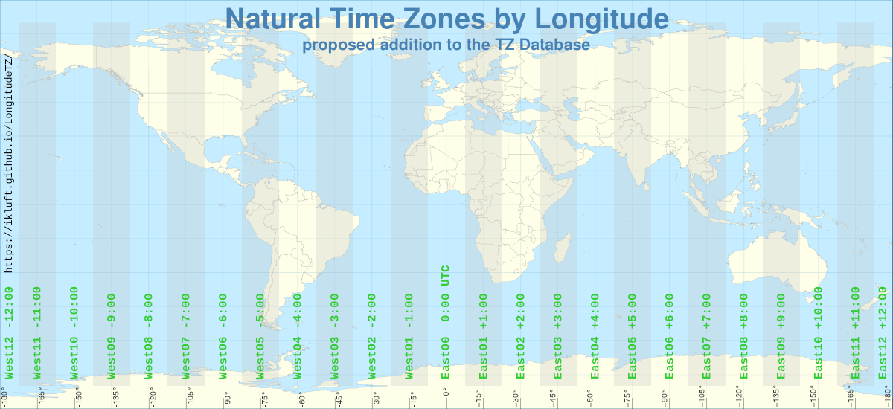
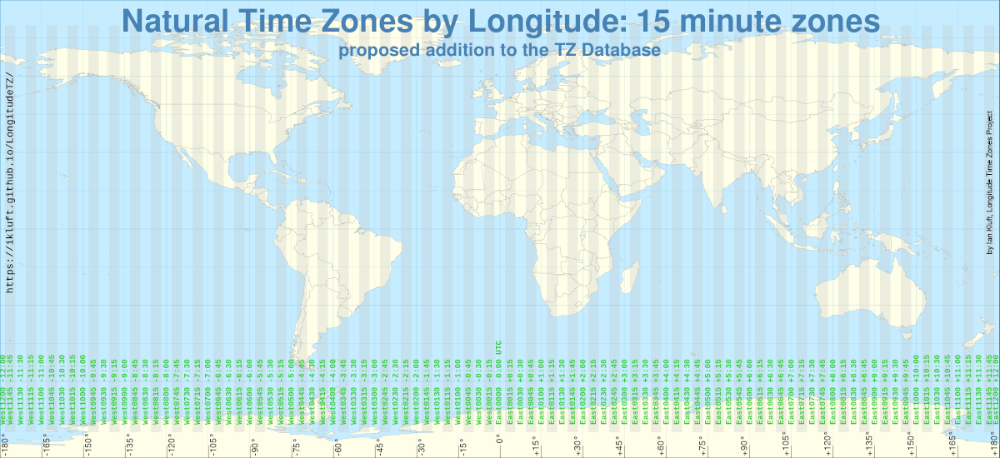

# The Solar Time Zones Definition

The Solar time zones definition includes the following rules.

* There are 24 hour-based Solar Time Zones, named West12, West11, West10, West09 through East12. East00 is equivalent to UTC. West00 is an alias for East00.
  * Hour-based time zones are spaced in one-hour time increments, or 15 degrees of longitude.
  * Each hour-based time zone is centered on a meridian at a multiple of 15 degrees. In positive and negative integers, these are 0, 15, 30, 45, 60, 75, 90, 105, 120, 135, 150, 165 and 180.
  * Each hour-based time zone spans the area ±7.5 degrees of longitude either side of its meridian.

* There are 96 narrow Solar Time Zones, named West1200 for 180 degrees West through East1200 for 180 degrees East. East0000 is equivalent to UTC. West0000 is an alias for East0000.
  * Longitude-based time zones are spaced in 15-minute time increments, or 3.75 degrees of longitude.
  * Each longitude-based time zone is centered on multiples of 3.75 degrees from 0 to ±180 degrees.
  * Each longitude-based time zone spans the area ±1.875 degrees of longitude either side of its meridian.

* In both hourly and longitude-based time zones, there is a limit to their usefulness at the poles. Beyond 80 degrees north or south, the definition uses UTC (East00 or East0000). This boundary is the only reason to include latitude in the computation of the time zone.
* When converting coordinates to a time zone, each time zone includes its boundary meridian at the lower end of its absolute value, which is in the direction toward 0 (UTC). The exception is at exactly ±180.0 degrees, which would be excluded from both sides by this rule. That case is arbitrarily set as +180 just to pick one.
* The category "Solar" is used for the longer names for these time zones. The names listed above are the short names. The full long name of each time zone is prefixed with "Solar/" such as "Solar/East00" or "Solar/East0000".
